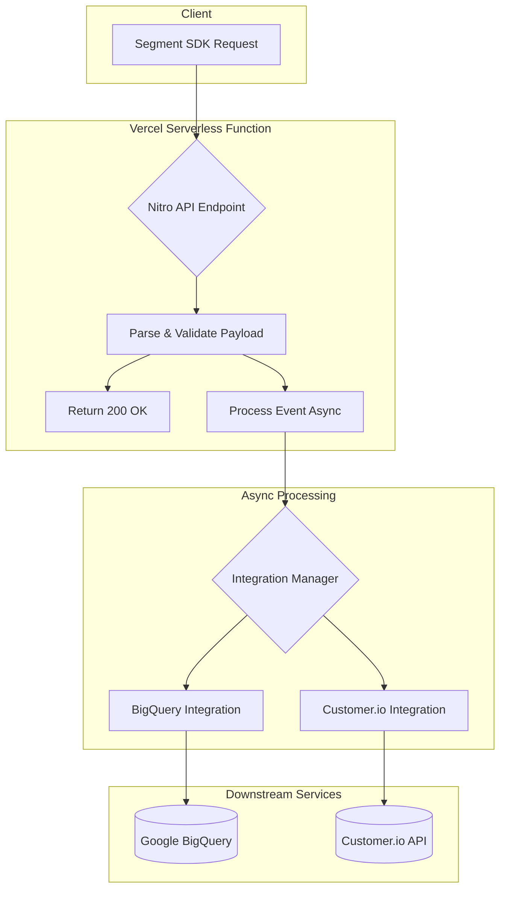

# OpenTrack

**OpenTrack** is a lightweight, open-source Segment alternative designed for high-performance event tracking and seamless integration with modern data stacks. Built to be deployed on serverless platforms like Vercel, it offers a Segment-compliant API that can process and route analytics events to various destinations with minimal latency.

## Table of Contents

- [Features](#features)
- [Architecture](#architecture)
- [API Endpoints](#api-endpoints)
- [Integrations](#integrations)
  - [Google BigQuery](#google-bigquery)
  - [Customer.io](#customerio)
- [Getting Started](#getting-started)
  - [Prerequisites](#prerequisites)
  - [Installation](#installation)
  - [Configuration](#configuration)
- [Usage](#usage)
  - [Using `analytics-node`](#using-analytics-node)
  - [Direct API Calls](#direct-api-calls)
- [Development](#development)
- [Contributing](#contributing)
- [License](#license)

## Features

- **Segment-Compliant API**: Drop-in replacement for Segment’s HTTP Tracking API. Use existing Segment SDKs with minimal configuration changes.
- **High Performance**: Built for serverless environments, OpenTrack provides rapid response times by processing events asynchronously.
- **Extensible Integration Framework**: Easily add new destinations for your analytics data.
- **Pre-built Integrations**: Out-of-the-box support for Google BigQuery and Customer.io.
- **Self-Hostable**: Deploy on Vercel or any other Node.js-compatible serverless platform for full control over your data pipeline.
- **Robust Validation**: Ensures data integrity with Zod-based schema validation for all incoming events.

## Architecture

OpenTrack is designed for speed and reliability. It leverages a serverless architecture to handle incoming API requests and processes events asynchronously.

Here’s a high-level overview of the data flow:



This asynchronous approach ensures that your application receives a fast response, while OpenTrack reliably delivers the data to your configured integrations.

## API Endpoints

OpenTrack emulates Segment’s HTTP Tracking API, providing the following endpoints:

- `POST /v1/track`
- `POST /v1/identify`
- `POST /v1/page`
- `POST /v1/group`
- `POST /v1/alias`

Payloads and responses for these endpoints are compatible with the official Segment API.

## Integrations

OpenTrack comes with pre-built support for the following integrations:

### Google BigQuery

- **Segment-Compatible Schema**: Data is stored in a schema that mirrors Segment's conventions, allowing you to use existing queries and BI tools.
- **Automatic Table & Schema Management**: Automatically creates datasets, tables, and columns, and adjusts data types as needed.
- **Dynamic SQL Views**: Includes a script to create analytics-ready views on top of your raw data.

### Customer.io

- **Full API Support**: Implements all core tracking methods (`identify`, `track`, `page`, `group`, `alias`).
- **Multi-Region Support**: Works with both US and EU data centers.
- **Resilient Delivery**: Features automatic retries with exponential backoff for reliable event delivery.

## Getting Started

Follow these steps to set up and run your own instance of OpenTrack.

### Prerequisites

- [Node.js](https://nodejs.org/) (v18 or later)
- [pnpm](https://pnpm.io/)

### Installation

1.  **Clone the repository**:

    ```bash
    git clone https://github.com/riven-io/opentrack.git
    cd opentrack
    ```

2.  **Install dependencies**:
    ```bash
    pnpm install
    ```

### Configuration

1.  **Create a `.env` file** in the root of the project.
2.  **Add the following environment variables** for the integrations you want to use:

    ```env
    # Customer.io
    CUSTOMERIO_SITE_ID=your-customerio-site-id
    CUSTOMERIO_API_KEY=your-customerio-api-key
    CUSTOMERIO_REGION=US # or EU

    # Google BigQuery
    BIGQUERY_PROJECT_ID=your-gcp-project-id
    BIGQUERY_DATASET=your_bigquery_dataset_name
    # Optional: Set to 'false' to manage BigQuery schema manually
    BIGQUERY_AUTO_TABLE_MANAGEMENT=true
    ```

    You will also need to set up Google Cloud authentication. Refer to the [Google Cloud documentation](https://cloud.google.com/docs/authentication/production) for details.

## Usage

You can send data to your OpenTrack instance using any Segment-compatible library or by making direct HTTP requests.

### Using `analytics-node`

The official `analytics-node` package can be used to send events to your OpenTrack instance by pointing it to your deployment's URL.

#### Installation

```bash
pnpm add analytics-node
```

#### Example

```javascript
import Analytics from 'analytics-node'

const analytics = new Analytics('', {
  host: 'https://your-opentrack-deployment.vercel.app',
})

// Identify a user
analytics.identify({
  userId: 'user-123',
  traits: {
    email: 'test@example.com',
    name: 'Test User',
    plan: 'premium',
  },
})

// Track a purchase event
analytics.track({
  userId: 'user-123',
  event: 'Product Purchased',
  properties: {
    productId: 'prod-456',
    price: 99.99,
    currency: 'USD',
  },
})

// Track a page view
analytics.page({
  userId: 'user-123',
  name: 'Pricing Page',
  properties: {
    url: 'https://your-app.com/pricing',
  },
})
```

### Direct API Calls

You can also send events directly to the API endpoints using `curl` or any other HTTP client.

```bash
curl -X POST https://your-opentrack-deployment.vercel.app/v1/track \
  -H 'Content-Type: application/json' \
  -d '{
        "userId": "user-123",
        "event": "Order Completed",
        "properties": { "revenue": 42.00 }
      }'
```

## Development

- **Run the development server**: `pnpm dev`
- **Run tests**: `pnpm test`
- **Lint code**: `pnpm lint`
- **Check types**: `pnpm typecheck`

## Contributing

Contributions are welcome! Please open an issue or submit a pull request if you have any ideas or improvements.

## License

This project is licensed under the MIT License - see the [LICENSE](LICENSE) file for details.
